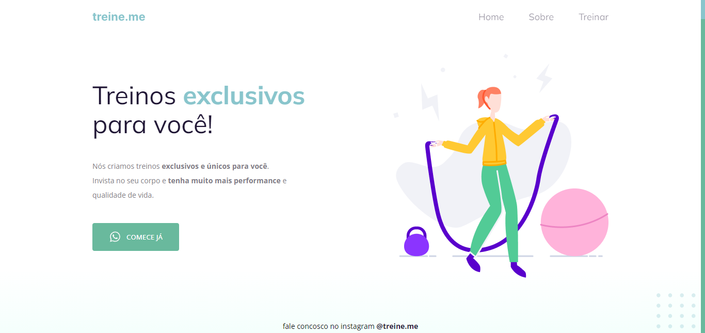

 

## 🖥️ Projeto
Esse projeto é de uma academia e tem como principal foco na fixação dos conceitos iniciais de HTML e CSS.

## ⚙️ Tecnologias
As tecnologias utilizadas nesse projeto são:

- HTML
- CSS
- GIT
- GITHUB
- FIGMA

## 👁️ Visualização
Aqui em baixo vai um link para acessa o layout do projeto
<a 
  href="https://www.figma.com/file/Ddfl0S19zUfoxevMTnqUPT/Explorer-Projeto-02-Copy?fuid=1125828957873851861" 
  alt="Layout do projeto no figma">Clique aqui</a>
